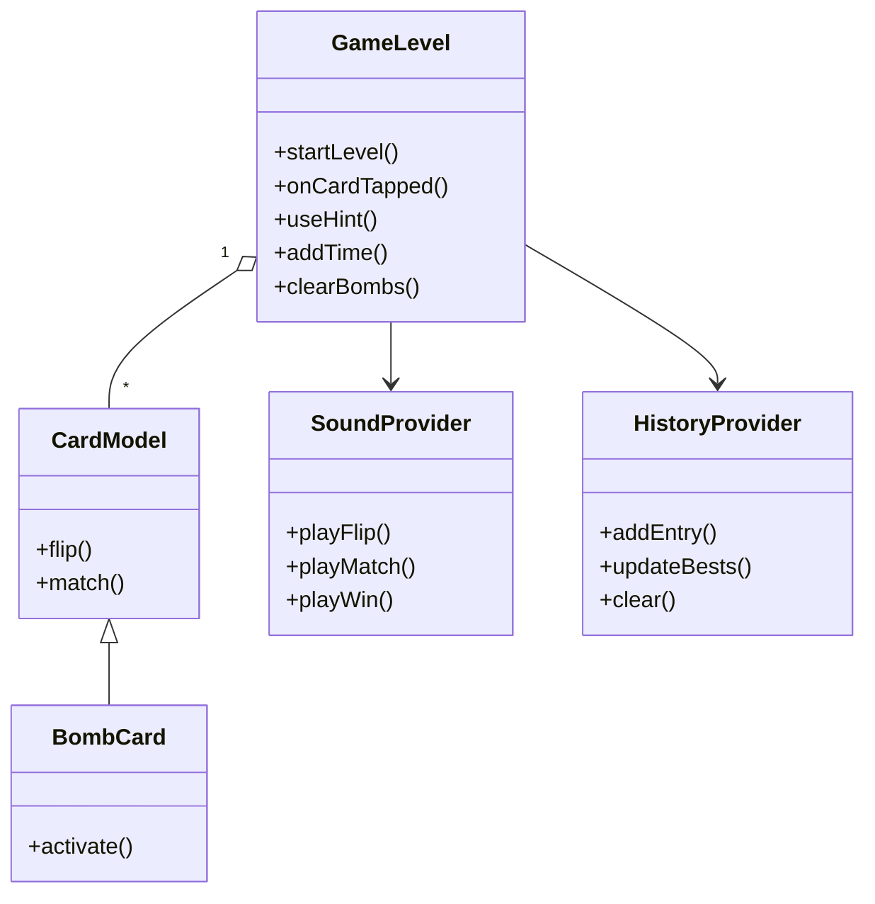
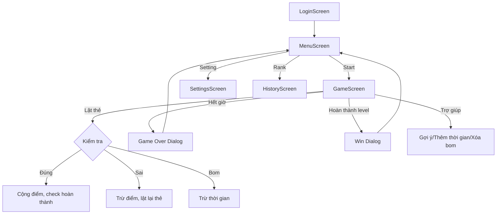

# Bậc Thầy Trí Nhớ (Memory Card Flip)

Game lật thẻ rèn luyện trí nhớ, đa cấp độ, giao diện sinh động, âm thanh sống động, hỗ trợ đa nền tảng.

---

## 🧩 Giới thiệu
"Bậc Thầy Trí Nhớ" là game lật thẻ giúp rèn luyện trí nhớ, tăng khả năng tập trung và phản xạ. Người chơi cần lật các cặp thẻ giống nhau trong thời gian giới hạn, vượt qua nhiều cấp độ với thử thách tăng dần.

---

## 🎮 Gameplay chi tiết
- **Mục tiêu:** Lật hết các cặp thẻ giống nhau trên bàn.
- **Level:** 11 cấp độ, càng lên cao càng nhiều thẻ và bom.
- **Thời gian:** Mỗi level có giới hạn thời gian, tăng dần theo độ khó.
- **Bom:** Từ level 3 xuất hiện bom, lật trúng bị trừ thời gian.
- **Trợ giúp:**
  - Thêm thời gian (+10s, 1 lần/level)
  - Gợi ý (lật toàn bộ thẻ trong 3s, 1 lần/level)
  - Loại bỏ toàn bộ bom (1 lần/level)
- **Điểm số:**
  - Ghép đúng: +20 điểm
  - Ghép sai: -5 điểm
  - Lịch sử điểm và xếp hạng được lưu lại
- **Kết thúc:**
  - Thắng: Lật hết thẻ trước khi hết giờ
  - Thua: Hết giờ chưa hoàn thành

---

## 🛠️ Công nghệ & gói sử dụng
- **Flutter:** Xây dựng giao diện và logic đa nền tảng
- **Provider:** Quản lý trạng thái toàn cục
- **Shared Preferences:** Lưu dữ liệu local (tên, lịch sử, điểm)
- **audioplayers:** Hiệu ứng âm thanh (lật thẻ, thắng, thua...)
- **video_player:** Video nền động cho menu/game

---

## 📁 Cấu trúc dự án & vai trò từng phần
- **lib/**: Mã nguồn chính
  - **main.dart**: Điểm khởi động app, cấu hình Provider, theme, route
  - **models/**: Logic game, dữ liệu thẻ, level, quản lý penalty, âm thanh
    - `card_model.dart`: Định nghĩa thẻ và bom
    - `game_level.dart`: Logic từng level, thời gian, xử lý lật thẻ, điểm số
    - `mismatch_penalty.dart`: Xử lý phạt khi ghép sai
    - `sound_manager.dart`: Quản lý phát âm thanh
  - **screens/**: Các màn hình giao diện
    - `menu_screen.dart`: Menu chính, chọn chế độ, vào game, cài đặt
    - `game_screen.dart`: Màn chơi chính, xử lý lật thẻ, bom, trợ giúp
    - `settings_screen.dart`: Đổi nhạc nền, theme, cài đặt khác
    - `history_screen.dart`: Lịch sử điểm, xếp hạng
  - **widgets/**:
    - `card_widget.dart`: Widget hiển thị thẻ, hiệu ứng lật
  - **providers/**:
    - `sound_provider.dart`: Quản lý trạng thái âm thanh
    - `history_provider.dart`: Quản lý lịch sử điểm, best score
    - `theme_provider.dart`: Quản lý theme giao diện
  - **themes/**:
    - `app_themes.dart`: Định nghĩa theme sáng/tối
- **assets/**: Tài nguyên
  - **cards/**: Ảnh các thẻ game
  - **audio/**: Nhạc nền, hiệu ứng (flip, match, mismatch, win, lose, bom)
  - **backgrounds/**: Video nền cho game
  - **cards/**: Ảnh các thẻ game
  - **video/**: Video menu, hướng dẫn

---

<div align="center">

# Sơ đồ tổng thể dự án

</div>

```plaintext
Bac_Thay_Tri_NhoTest/
├── assets/
│   ├── Icons/
│   │   └── Icon.png
│   ├── audio/
│   │   ├── NhacNen1.mp3
│   │   ├── bum.mp3
│   │   ├── flip.mp3
│   │   ├── lose.mp3
│   │   ├── match.mp3
│   │   ├── mismatch.mp3
│   │   └── win.mp3
│   ├── backgrounds/
│   │   ├── Dark.mp4
│   │   ├── Light.mp4
│   │   └── Syteam.mp4
│   ├── cards/
│   │   ├── 1.png
│   │   ├── 2.png
│   │   ├── 3.png
│   │   ├── 4.png
│   │   ├── 5.png
│   │   ├── 6.png
│   │   ├── 7.png
│   │   ├── 8.png
│   │   ├── 9.png
│   │   ├── 10.png
│   │   ├── 11.png
│   │   ├── 12.png
│   │   ├── bom.png
│   │   └── NenThe1.png
│   └── video/
│       ├── DangK.mp4
│       └── Menu.mp4
├── lib/
│   ├── main.dart
│   ├── login_controller.dart
│   ├── login_screen.dart
│   ├── bac_thay_tri_nho/
│   ├── models/
│   │   ├── card_model.dart
│   │   ├── game_level.dart
│   │   ├── mismatch_penalty.dart
│   │   └── sound_manager.dart
│   ├── providers/
│   │   ├── history_provider.dart
│   │   ├── sound_provider.dart
│   │   └── theme_provider.dart
│   ├── screens/
│   │   ├── game_screen.dart
│   │   ├── history_screen.dart
│   │   ├── menu_screen.dart
│   │   └── settings_screen.dart
│   ├── themes/
│   │   └── app_themes.dart
│   └── widgets/
│       └── card_widget.dart
```

---

## Sơ đồ lớp (Class Diagram)


---

## Sơ đồ nguyên lý hoạt động (Flow/Activity)


---

## Sơ đồ thread/luồng xử lý
```plaintext
[UI Thread/Main Isolate]
   |
   |-- Timer (GameLevel): đếm ngược thời gian
   |-- Future/async: lưu lịch sử, phát âm thanh, load prefs
   |
   |-- Không có thread phụ explicit (không spawn Isolate mới)
```

---

## Tài nguyên
- Ảnh thẻ: PNG chất lượng cao, dễ phân biệt
- Âm thanh: Định dạng mp3, hiệu ứng flip, match, mismatch, win, lose, bom
- Video nền: mp4, tối ưu cho hiệu năng
- Icon: PNG cho launcher app

---

## Hướng dẫn cài đặt & chạy
1. **Yêu cầu:**
   - Flutter SDK >= 3.0.0
   - Dart
2. **Cài đặt:**
   ```bash
   flutter pub get
   ```
3. **Chạy ứng dụng:**
   ```bash
   flutter run
   ```
   - Hỗ trợ Android/iOS/Web/Windows/Mac/Linux

---

## Tuỳ chỉnh & mở rộng
- Đổi nhạc nền, theme sáng/tối, tên người chơi
- Dễ dàng thêm level, chủ đề thẻ, hiệu ứng mới
- Có thể tích hợp đăng nhập, lưu cloud, bảng xếp hạng online

---

## Đóng góp
- Fork repo, tạo branch mới, PR mô tả rõ chức năng
- Báo lỗi, đề xuất tính năng qua Issues

---

## FAQ
- **Chạy được trên nền tảng nào?**
  - Android, iOS, Windows, Mac, Linux, Web
- **Có thể thêm thẻ mới không?**
  - Có, chỉ cần thêm ảnh vào assets/cards và cập nhật danh sách trong code
- **Làm sao reset lịch sử/xếp hạng?**
  - Vào màn hình lịch sử, chọn "Xóa lịch sử"

---

## Giấy phép
```bash
MIT License

Copyright (c) 2025 Trần Văn Trường

Permission is hereby granted, free of charge, to any person obtaining a copy
of this software and associated documentation files (the "Software"), to deal
in the Software without restriction, including without limitation the rights
to use, copy, modify, merge, publish, distribute, sublicense, and/or sell
copies of the Software, and to permit persons to whom the Software is
furnished to do so, subject to the following conditions:

The above copyright notice and this permission notice shall be included in all
copies or substantial portions of the Software.

THE SOFTWARE IS PROVIDED "AS IS", WITHOUT WARRANTY OF ANY KIND, EXPRESS OR
IMPLIED, INCLUDING BUT NOT LIMITED TO THE WARRANTIES OF MERCHANTABILITY,
FITNESS FOR A PARTICULAR PURPOSE AND NONINFRINGEMENT. IN NO EVENT SHALL THE
AUTHORS OR COPYRIGHT HOLDERS BE LIABLE FOR ANY CLAIM, DAMAGES OR OTHER
LIABILITY, WHETHER IN AN ACTION OF CONTRACT, TORT OR OTHERWISE, ARISING FROM,
OUT OF OR IN CONNECTION WITH THE SOFTWARE OR THE USE OR OTHER DEALINGS IN THE
SOFTWARE.
```
---
